# oXygen XML Editor framework for XProc 3.x users

Add-on for [oXygen XML Editor](https://www.oxygenxml.com/xml_editor.html) with tools for editing and applying [XProc 3.x](https://xproc.org) pipelines.

## Prerequisites

- [Saxon-HE 12.7](https://github.com/Saxonica/Saxon-HE/releases/tag/SaxonHE12-7 "Download SaxonHE12-7J")
- [MorganaXProc-IIIse 1.6.7](https://sourceforge.net/projects/morganaxproc-iiise/files/MorganaXProc-IIIse-1.6.7/ "Donwload MorganaXProc-IIIse 1.6.7")

### Setting up the environment

- [ ] Extract content of the [MorganaXProc-IIIse-1.6.7.zip](https://sourceforge.net/projects/morganaxproc-iiise/files/MorganaXProc-IIIse-1.6.7/MorganaXProc-IIIse-1.6.7.zip/download "Donwload MorganaXProc-IIIse 1.6.7.zip file")
- [ ] Extract content of the [SaxonHE12-7J.zip](https://github.com/Saxonica/Saxon-HE/releases/download/SaxonHE12-7/SaxonHE12-7J.zip "Download SaxonHE12-7J") file
  - [ ] copy extracted `saxon-he-12.7.jar` and `saxon-he-xqj-12.7.jar` files to the `MorganaXProc-IIIse_lib` folder
- [ ] On your operating system, set environment `PATH` variable to point to the location of the `MorganaXProc-IIIse` folder
- for example on Windows:
  - (run command line as usual user): `setx PATH "%PATH%;C:\Programs\MorganaXProc-IIIse"`
  - (run command line as administrator): `setx /m PATH "%PATH%;C:\Programs\MorganaXProc-IIIse"`
    - [switch](https://learn.microsoft.com/en-us/windows-server/administration/windows-commands/setx) `/m`: Specifies to set the variable in the system environment. The default setting is the local environment.

## Features

- framework is associated only with files from `http://www.w3.org/ns/xproc` namespace with `declare-step` or `library` root element and `@version` attribute with value `3.0` or `3.1`
- transformation scenarios
- schema validation

## Installation

The framework can be installed from this repository.

The installation process of the framework is described in the [documentation](https://www.oxygenxml.com/doc/versions/25.1/ug-editor/topics/installing-and-updating-add-ons.html) of the oXygen XML editor.

You can also follow these steps:

- Add URL of this repository to the list of `Update Site Add-ons` (`Options` > `Prefences` > `Add-ons`).

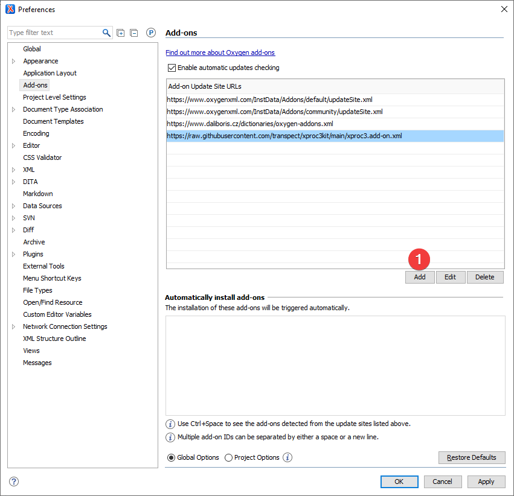

- Click on `Add` button and accept risk warnings.

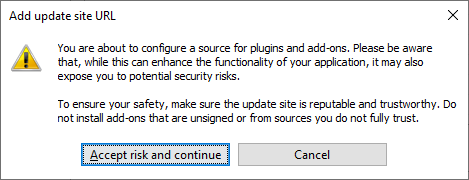

- Add following URL to the box: `https://daliboris.github.io/xproc-framework-for-oxygen/oxygen-addons.xml`.

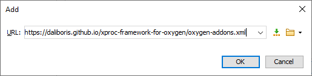

- Click on the `OK` button and URL for this framework should appear in the list.

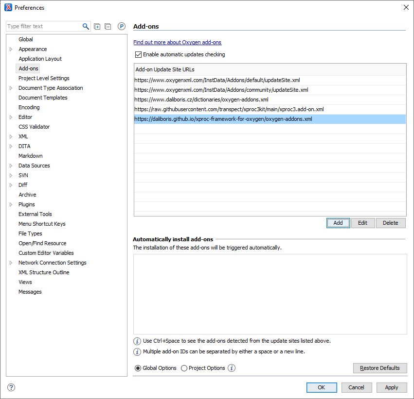

- Install the framework from the help menu: `Help` > `Install new add-ons`.

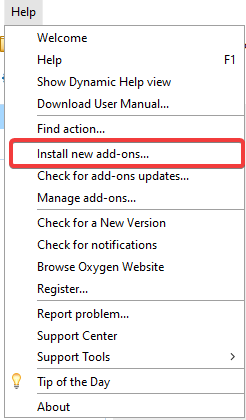

- From the combo box for `Show add-ons from` select URL you entered in previous steps (`https://daliboris.github.io/xproc-framework-for-oxygen/oxygen-addons.xml`).

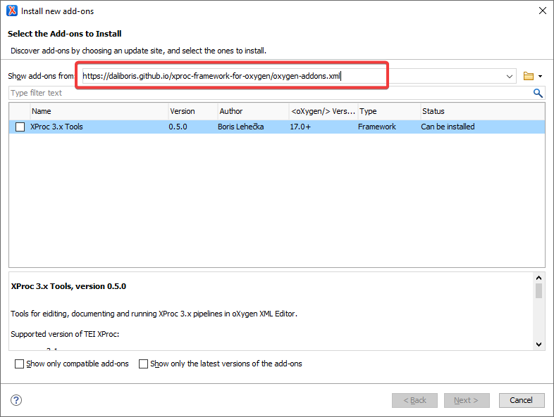

- In the warning dialog box (ZIP file `https://daliboris.github.io/xproc-framework-for-oxygen/xproc-framework-for-oxygen.zip` is downloaded), click on `Allow`.

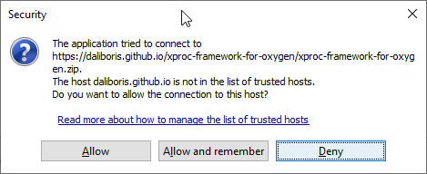

- In the next step you can select the `XProc 3.x Tools` to be installed. Check the box an click on the `Install`.

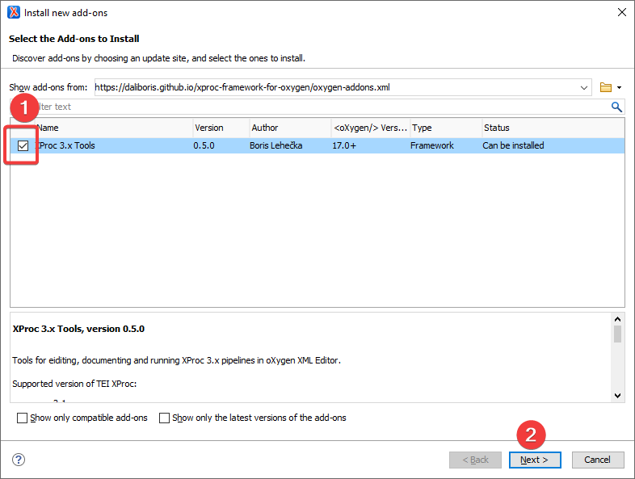

- Accept all terms of the end user license agreements (GNU 3) and click on `Install` button.

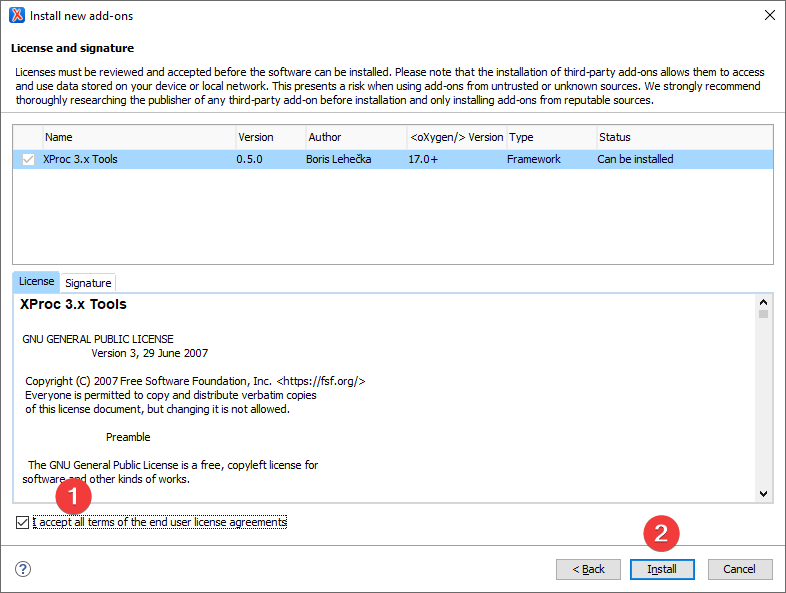

- Or you can switch to the `Signature` tab to see that the framework is not digitally signed.

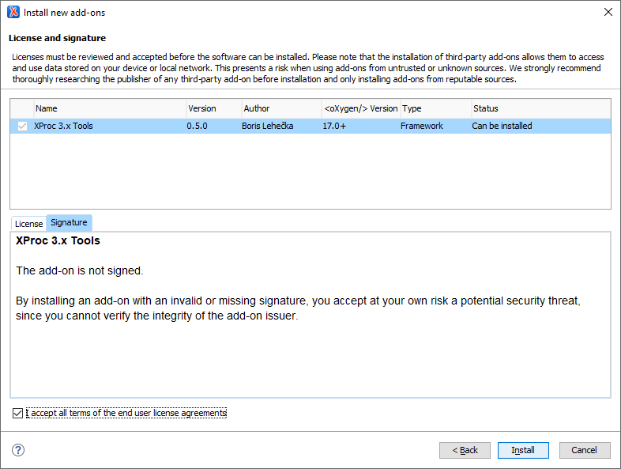

- Before the installation itself, accept the warning about no valid digital signatures.

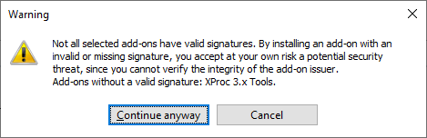

- The installation ends with the notification that restart of the oXygen XML Framework is required.

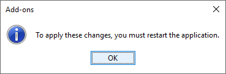

- After new start, you can find `XProc 3.x Tools` framework in the list of installed Add-ons (`Options` > `Prefences` > `Document Type Association`)

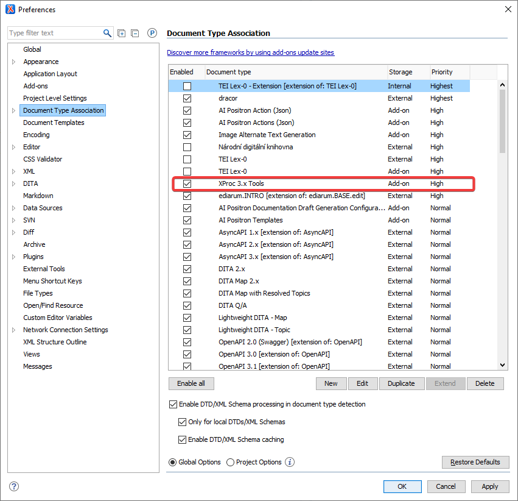

## Use

- open XProc 3.0 or 3.1 file
- on the `Transformation Scenarios` panel click on the red `Play` button

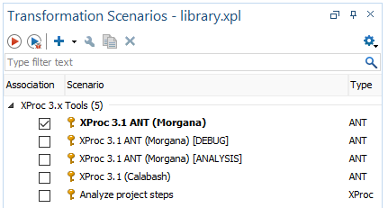